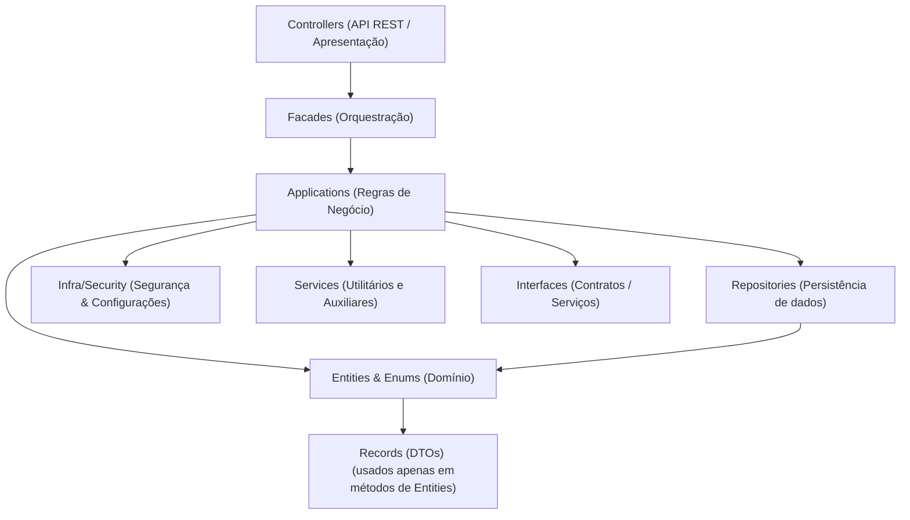

# App.Fitness

## Descrição

O **App.Fitness** é uma aplicação desenvolvida em Java com Spring Boot, voltada para o gerenciamento de desafios fitness, grupos, usuários e patrocinadores. O sistema permite o cadastro, autenticação e administração de usuários, criação e acompanhamento de desafios, registro de check-ins, além de funcionalidades de ranking, apostas e recompensas para os melhores colocados.

## Objetivos

- **Promover o engajamento em atividades físicas** por meio de desafios entre grupos e usuários.
- **Oferecer um sistema de ranking** baseado em check-ins, estimulando a participação contínua.
- **Permitir apostas em desafios**, onde os participantes contribuem para um prêmio.
- **Recompensar os três primeiros colocados** no ranking de cada desafio, incentivando a competitividade saudável.
- **Facilitar a integração com patrocinadores** para apoiar desafios e premiar usuários.

## Funcionalidades

- Cadastro e autenticação de usuários (admin, usuário, patrocinador) com segurança JWT.
- Criação, atualização e acompanhamento de desafios fitness.
- Administração de grupos de usuários e participação em desafios.
- Registro de check-ins diários nos desafios.
- Sistema de apostas: usuários podem apostar para participar de desafios com premiação.
- Ranking automático dos participantes com base na frequência de check-ins.
- Premiação automática para os três primeiros colocados ao final do desafio.
- Integração com patrocinadores para apoio e premiação.
- Gerenciamento de categorias e objetivos dos desafios.
- API RESTful para integração com frontends e aplicativos móveis.

## Estrutura do Projeto

O projeto segue uma arquitetura em camadas, separando responsabilidades para facilitar manutenção, testes e escalabilidade:

```
src/
  main/
    java/com/example/demo/
      applications/         # Camada de aplicação (regras de negócio)
      config/               # Configurações globais e exceções
      controllers/          # Controllers REST (endpoints da API)
      entities/             # Entidades JPA (modelos do banco de dados)
      enums/                # Enumerações do domínio (Status, TipoDesafio, Objetivo, etc)
      facades/              # Facades para orquestração e integração entre serviços
      infra/security/       # Implementação de segurança e autenticação (JWT)
      interfaces/           # Interfaces dos serviços e contratos
      records/              # Records para DTOs (Data Transfer Objects)
      repositories/         # Repositórios JPA (acesso ao banco de dados)
      services/             # Serviços auxiliares e utilitários
    resources/
      application.properties # Configurações da aplicação
  test/
    java/com/example/demo/
      AppFitnessApplicationTests.java # Testes automatizados
```

## Arquitetura do Projeto


**Nota:**  
No meu projeto, os Records (DTOs) são utilizados principalmente em métodos das Entities para expor dados de forma simplificada, e **não** como objetos de entrada/saída nos Controllers ou Facades.

> Essa estrutura segue o padrão N-Layer, separando responsabilidades para facilitar manutenção, testes e escalabilidade. 

### Fluxo dos Desafios com Ranking e Aposta

1. **Criação do Desafio**: Um usuário (admin ou patrocinador) cria um desafio, define regras, valor da aposta e recompensa.
2. **Participação**: Usuários entram no desafio, aceitam as regras e realizam a aposta.
3. **Check-in Diário**: Participantes registram check-ins diários para acumular pontos no ranking.
4. **Ranking**: O sistema calcula automaticamente o ranking dos participantes com base na frequência e regularidade dos check-ins.
5. **Premiação**: Ao final do desafio, os três primeiros colocados recebem a recompensa (prêmio acumulado das apostas ou patrocinador).
6. **Transparência**: Todos os rankings e resultados ficam disponíveis via API.

## Como Executar

1. **Pré-requisitos:**  
   - Java 11 ou superior  
   - Maven

2. **Instalação:**  
   Clone o repositório e instale as dependências:
   ```sh
   git clone <url-do-repositorio>
   cd App.Fitness
   ./mvnw clean install
   ```

3. **Execução:**  
   Inicie a aplicação:
   ```sh
   ./mvnw spring-boot:run
   ```

4. **Acesso:**  
   A API estará disponível em `http://localhost:8080`.

## Integração com o App PushUp

Esta API foi criada especificamente para servir como backend do aplicativo **PushUp**, que compartilha os mesmos objetivos de promover desafios fitness, ranking por check-ins, apostas e recompensas. Toda a lógica de negócio, autenticação, registro de atividades e gerenciamento de desafios é exposta via endpoints RESTful, permitindo que o app PushUp ofereça uma experiência completa e interativa aos seus usuários.

O frontend do PushUp (mobile ou web) irá consumir esta API para todas as operações, garantindo segurança, escalabilidade e integração eficiente entre as camadas do sistema.

## Autenticação

A autenticação é baseada em JWT. Utilize os endpoints de `/auth` para login e obtenção do token.

## Contribuição

Contribuições são bem-vindas! Sinta-se à vontade para abrir issues ou pull requests.

---
